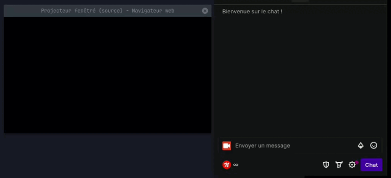

# Twitch websocket (EventSub) custom reward listener



## Description

This repository contains examples using Twitch's API and websocket ([EventSub](https://dev.twitch.tv/docs/eventsub/)) to
display a counter between two channel points rewards in OBS, using
the [device authentication](https://dev.twitch.tv/docs/authentication/getting-tokens-oauth/#device-code-grant-flow)
system without the need for a web server.

The idea came from a viewer during a stream by [KEMIST_C10H15N](https://www.twitch.tv/kemist_c10h15n), who wanted to
know the number of "blessings" and "curses" received during a run of DARK SOULS 3.

> [!TIP]
> Completely royalty-free, if this example can be useful in your project. Let's go!

## Preface

To use this project and maintain control over your data, you need to create your own application. First, you need
to [log in as a developer](https://dev.twitch.tv/docs/authentication/register-app/) on Twitch and get a `Client ID` for
your application.  
Once logged in, under `Applications` > `Register Your Application`, fill in the information as shown below.


- <b>Name</b>: `name of my cool app`
- <b>OAuth Redirect URLs</b>: `http://localhost`
    - For this application, we're not using a server, but an URL must be provided.
- <b>Category</b>: `Broadcaster Suite`
- <b>Client Type</b>: `Public`
    - <i style="color : red">Caution, this parameter cannot be changed after the application is created.</i>
    - If you don't choose "Public", as we're not using a server, we won't be able to refresh the token provided by
      Twitch to make requests to the API.

Once you've clicked the `Create` button, you can retrieve your `Client ID` and proceed to the next step.

## Installation and Configuration

Download the project sources from the [Releases](https://github.com/Nyrrell/twitch-eventsub-reward/releases/latest) tab.

In the `config.js` file at the root of the project, fill in the fields with your configuration to identify your
application with Twitch:

Fill in at least your `CLIENT_ID`, the `SCOPES`
to [read channel rewards](https://dev.twitch.tv/docs/eventsub/eventsub-subscription-types/#channelchannel_points_custom_reward_redemptionadd),
and set `INIT` to `true`.

```js
const config = {
  "CLIENT_ID": "0123456789ABCDEF", // the client ID from the preface
  "SCOPES": "channel:read:redemptions", // permission to read channel points
  "BROADCASTER_USERNAME": "kemist_c10h15n", // the Twitch username concerned
  "INIT": true, // true to perform application initialization
  "DEBUG": false, // true if you want information in case of problems
  // THE FIELDS BELOW WILL BE FILLED AFTER THE INITIALIZATION PHASE
  "ACCESS_TOKEN": "", // the token for making requests to the Twitch API
  "REFRESH_TOKEN": "", // to get a new ACCESS_TOKEN when the token is expired
  "DEVICE_CODE": "", // the identifier of our "device" to obtain our token
  "BROADCASTER_ID": "", // the Twitch ID of the streamer from whom we retrieve information
  "CURSE_REWARD": "", // the ID of the first reward to track
  "BLESS_REWARD": "", // the ID of the second reward to track
}
```

Before integrating our web page into OBS, it's easier to go through the initialization phase in a regular browser. Open
the `index.html` file in the `src` folder, and follow the instructions displayed in the browser.

If you're doing the initialization directly in OBS, since it's not possible to open a popup window, you'll need to go to
the device activation page and enter the code displayed on the OBS browser screen.

Once the device initialization is successful, you'll get your final configuration to update your `config.js` file. You
can also retrieve your `BROADCASTER_ID` and the list of channel rewards to get the IDs of your `CURSE_REWARD`
and `BLESS_REWARD`.


Update your `config.js` file with the configuration obtained in the previous step. Also, make sure to set the `INIT`
parameter to `false` to indicate that this step has already been completed.

If not already done, add your local file `index.html` to OBS. This will allow the application to connect to Twitch's
EventSub websocket and receive channel points rewards claimed by viewers.

The application will update its `ACCESS_TOKEN` and `REFRESH_TOKEN` as needed and save them to the browser's local
storage. This means that eventually, those entered in the `config.js` file won't be used by the application to
authenticate with Twitch anymore.

> [!WARNING]
> After adding our application to OBS, it's best not to open the `index.html` file in another browser anymore. If you
> need to request a new token from Twitch using an expired `refresh_token`, Twitch will end the valid token, and you'll
> need to restart the initialization process.

Don't worry if you perform a new initialization, the `DEVICE_CODE` will change. The application will know not to use the
browser's storage and will again use the contents of the configuration file to update the local storage of the browser.

## Connection Indicator

When the application is connecting to Twitch, it displays 3 rapidly blinking dots to indicate this state:


If the application fails to connect, it displays 3 slowly blinking red dots:


For more information about why this failed, in the `config.js` file, set the `debug` parameter to `true` and reload the
page.

## How to Reset the Counter?

To reset the counter to zero, the first option is to refresh the `index.html` web page in OBS. The downside of this
method is that you will be disconnected from the websocket and the application will need to establish a new connection
to the Twitch server.

The second option is to add a second browser source in OBS and choose the `trigger-reset.html` file. This source doesn't
display anything, we will only use the refreshing of this page to send a message to our counter, indicating that it
should reset to zero.
The major advantage of this solution is that it keeps our websocket session open and listening.

In the properties of the browser source of the `trigger-reset.html` file, check this box:


Then, in the OBS settings, in the Keyboard Shortcuts tab, add the `keyboard shortcut` of your choice to show and hide
the browser source, or use your Stream Deck if you have one.


The source containing the `trigger-reset.html` page will reset the counter to zero when you hide or show it.

## Customization of Style in OBS

It's possible to customize the style of our reward counter by modifying the values of existing variables. In OBS, in the
properties of the browser source for our `index.html` file, you can add the following CSS to the `Custom CSS` section,
in addition to the existing CSS:

```css
:root {
  --orderBar: column;
  --curseEmoji: '💀';
  --blessEmoji: '🙏';
  --curseBarColor: rgba(0, 63, 92, 0.9);
  --blessBarColor: rgba(255, 166, 0, 0.9);
  --numberColor: rgba(255, 255, 255, 0.9);
}
```

**Description of Properties:**

- `--orderBar`: Allows you to choose the order between the bar and the counter values.
    - Only accepts `column` or `column-reverse`.
- `--curseEmoji`: Emoji used to count curses.
- `--blessEmoji`: Emoji used to count blessings.
- `--curseBarColor`: Color of the curses bar.
- `--blessBarColor`: Color of the blessings bar.
- `--numberColor`: Color of the displayed values.

## How to Update the Application?

Download the sources of the latest [Release](https://github.com/Nyrrell/twitch-eventsub-reward/releases/latest)
available.
Replace the content of the `src` folder with what you just downloaded.
It's not necessary to overwrite the `config.js` file unless specified in the release notes.