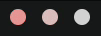
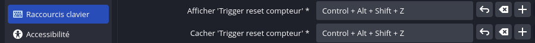

# TWITCH WEBSOCKET CUSTOM REWARD LISTENER


Ce dépôt contient des exemples utilisant l'API et le websocket ([EventSub](https://dev.twitch.tv/docs/eventsub/)) de
Twitch pour afficher un compteur entre deux
récompenses de points de chaîne dans OBS, en utilisant le système
de [connexion par appareil](https://dev.twitch.tv/docs/authentication/getting-tokens-oauth/#device-code-grant-flow) sans
avoir à utiliser un
serveur web.

L'idée m'est venue d'un spectateur lors d'un stream de [KEMIST_C10H15N](https://www.twitch.tv/kemist_c10h15n), qui
aurait voulu connaître le nombre de "bénédictions" et de "malédictions" reçues lors d'une run sur DARK SOULS 3.

> [!TIP]
> Totalement libre de droits, si cet exemple peut vous être utile dans votre projet. Let's go !

## Préambule

Pour pouvoir utiliser ce projet et garder le contrôle sur vos données, vous devez créer votre propre application. Vous
devrez d'abord [vous connecter en tant que développeur](https://dev.twitch.tv/docs/authentication/register-app/) sur
Twitch et obtenir un `Client ID` pour votre application.  
Une fois connecté, dans `Applications` > `Enregistrer votre application`, remplissez les informations comme ci-dessous.


- <b>Nom</b> : `nom de ma cool app`
- <b>URL de redirection OAuth</b> : `http://localhost`
    - Pour cette application, nous n'utilisons pas de serveur, mais une URL doit être saisie.
- <b>Catégorie</b> : `Broadcaster Suite`
- <b>Type de client</b> : `Publique`
    - <i style="color : red">Attention, il n'est plus possible de changer ce paramètre après la création de
      l'application.</i>
    - Si vous ne choisissez pas "Publique", comme nous n'utilisons pas de serveur, nous ne
      pourrons pas actualiser le token fourni par Twitch pour effectuer nos requêtes à l'API.

Une fois que vous avez cliqué sur le bouton `Créer`, vous pouvez récupérer votre `Client ID` (Identifiant client) et
passer à la suite.

## Installation et configuration

Téléchargez les sources du projet dans
l'onglet [Releases](https://github.com/Nyrrell/twitch-eventsub-reward/releases/latest).

Dans le fichier `config.js` à la racine du projet, remplissez les champs avec votre configuration pour identifier votre
application auprès de Twitch :

Remplissez au minimum votre `CLIENT_ID`, le `SCOPES`
pour [lire les récompenses de chaînes](https://dev.twitch.tv/docs/eventsub/eventsub-subscription-types/#channelchannel_points_custom_reward_redemptionadd),
et mettez `INIT` à `true`.

```js
const config = {
  "CLIENT_ID": "0123456789ABCDEF", // l'identifiant client du préambule
  "SCOPES": "channel:read:redemptions", // l'autorisation de lire les points de chaîne 
  "BROADCASTER_USERNAME": "kemist_c10h15n", // l'username Twitch concerné
  "INIT": true, // true pour effectuer l'initialisation de l'application
  "DEBUG": false, // true si vous voulez avoir des informations en cas de problème
  // LES CHAMPS CI-DESSOUS SERONT À REMPLIR APRÈS LA PHASE D'INITIALISATION
  "ACCESS_TOKEN": "", // le token permetant de faire des requetes à l'api Twitch
  "REFRESH_TOKEN": "", // pour obtenir un nouveau ACCESS_TOKEN lorsque le token est expiré
  "DEVICE_CODE": "", // l'identifiant de notre "appareil" pour obtenir notre token
  "BROADCASTER_ID": "", // l'ID Twitch du streamer dont nous récupérons les infos
  "CURSE_REWARD": "", // l'ID de la première récompense à suivre
  "BLESS_REWARD": "", // l'ID de la seconde récompense à suivre
}
```

Avant d'intégrer notre page web dans OBS, il est plus simple de faire la phase d'initialisation dans un navigateur
classique. Ouvrir le fichier `index.html` dans le dossier `src`, toutes les instructions sont affichées dans le
navigateur.

Si vous effectuez l'initialisation directement dans OBS, étant donné qu'il n'est pas possible d'ouvrir une fenêtre
contextuelle, vous devrez vous rendre sur la page [d'activation des appareils](https://www.twitch.tv/activate) et saisir
le code qui s'affiche à l'écran du navigateur OBS.

Une fois l'initialisation de l'appareil réussie, vous obtenez votre configuration finale pour mettre à jour votre
fichier `config.js`. Vous pouvez également récupérer votre `BROADCASTER_ID` et la liste des récompenses de chaînes pour
obtenir l'ID de votre `CURSE_REWARD` et de votre `BLESS_REWARD`.


Mettez à jour votre fichier `config.js` avec la configuration obtenu à l'étape précédente. Assurez-vous également de
bien mettre le paramètre `INIT` à `false` pour indiquer que cette étape a déjà été validée.

Si ce n'est pas déjà fait, ajoutez dans OBS votre fichier local `index.html`. Cela permettra à l'application de se
connecter au websocket EventSub de Twitch et de recevoir les récompenses de points de chaîne réclamées par les
spectateurs.

L'application mettra à jour au fur et à mesure son `ACCESS_TOKEN` et `REFRESH_TOKEN` et les enregistrera dans le
stockage local du navigateur. Cela signifie qu'à terme, ceux renseignés dans le fichier `config.js` ne seront plus
utilisés par l'application pour s'authentifier auprès de Twitch.

> [!WARNING]
> Après avoir ajouté notre application à OBS, il est préférable de ne plus ouvrir le fichier `index.html` dans un autre
> navigateur. Si vous devez demander à Twitch un nouveau token en utilisant un `refresh_token` expiré, Twitch va mettre
> fin au token valide et vous devrez recommencer le processus d'initialisation.

Pas de panique si vous effectuez une nouvelle initialisation, le `DEVICE_CODE` changera. L'application saura qu'elle ne
doit pas utiliser le stockage du navigateur et utilisera à nouveau le contenu du fichier de configuration pour mettre à
jour celui du stockage local du navigateur.

## Indicateur de connexion

Lorsque l'application est en train de se connecter à Twitch, elle affiche 3 points clignotants rapidement pour indiquer
cet état :


Si l'application n'a pas réussi à se connecter, elle affiche 3 points de couleur rouge clignotant lentement :



Pour obtenir plus d'informations sur la raison de cet échec, dans le fichier `config.js`, mettez le paramètre `debug`
à `true` et rechargez la page.

## Comment réinitialiser le compteur ?

Pour remettre le compteur à zéro, la première possibilité est d'actualiser la page web `index.html` dans OBS. L'inconvénient de cette
méthode est que vous serez déconnecté du websocket et il faudra que l'application établisse une nouvelle connexion au
serveur Twitch.

La deuxième possibilité est d'ajouter dans OBS une seconde source de navigateur et de choisir le
fichier `trigger-reset.html`. Cette source n'a rien à afficher, on va seulement se servir du rafraîchissement de cette
page pour émettre un message à notre compteur, lui indiquant qu'il doit se remettre à zéro.  
L'avantage majeur de cette solution est que l'on garde notre session websocket ouverte et à l'écoute.

Dans les propriétés de la source du navigateur du fichier `trigger-reset.html`, il faut cocher cette case :


Ensuite, dans les paramètres d'OBS, dans l'onglet `Raccourcis clavier`, ajoutez le raccourci clavier de votre choix pour
afficher et cacher la source de votre navigateur, ou utilisez votre Stream Deck si vous en avez un.



La source contenant la page `trigger-reset.html` permettra de remettre le compteur à zéro dès que vous la masquerez ou l'afficherez.

## Comment mettre à jour l'application ?

Téléchargez les sources de la
dernière [version (Release)](https://github.com/Nyrrell/twitch-eventsub-reward/releases/latest) disponible.  
Remplacez le contenu du dossier `src` avec celui que vous venez de télécharger.  
Il n'est pas nécessaire d'écraser le fichier `config.js`, sauf si la note de la release le spécifie.
